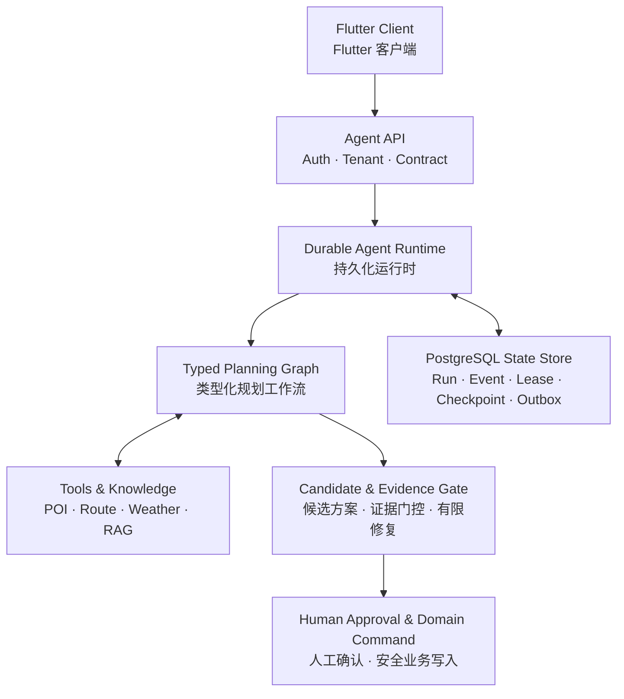

# **🌍 GoNow 寻迹**

**「 让每次出发都有迹可循 / Never lose track of your journey 」**

[📱 申请内测 (Waitlist)](#bookmark=id.4uewzkleyekb) • [📧 联系作者](mailto:tu07918382691@gmail.com)

## **📖 项目简介 (About)**

**GoNow 寻迹** 是一款集**旅程记录、行程规划、手账记录、旅行资产管理**于一体的全场景高可用应用。我们致力于解决传统旅行软件中的状态断层与信息过载问题，通过智能算法与大模型 AI 伴创，为热爱旅行的用户提供丝滑、沉浸、极具个性化的行前、行中、行后全链路体验。

一款**由 AI Agent 驱动的全生命周期智能旅行应用**，覆盖**目的地发现、行程规划、行中伴游、多人协作、旅行手账与费用结算**。项目采用 Flutter、Python Agent Service、PostgreSQL/Supabase 构建，通过**可恢复的 Agent Runtime、约束验证、证据化 RAG、结构化记忆与人工确认机制**，将大模型生成的旅行建议转化为可验证、可编辑、可安全落地的结构化行程。

## **📱 视觉预览 (Screenshots)**

1.盲盒功能：点击抽取周末/国际盲盒随机旅游目的地，并且一键询问AI规划旅游路线。规划若有不满意之处可继续询问AI进行改进，直至满意即可一键导入行程。给AI的系统prompt经精心设计，综合考虑多因素规划路线，实现住宿-景点-交通-餐饮的全面高质量安排。

2.入乡随俗：用于科普世界各地的法律习俗冷知识      免签直飞：展示所有对中国免签的国家，让旅行说走就走

3.行程：从我的行程卡片中选取一个进入行程。在**规划模式**中AI会根据行程搜集相关信息，总结并列出三个模块用于行程前的准备与提醒，并且粗略列出每一天的景点安排，此模式下的地图景点之间的连线是直连飞线模式，清晰明了地展示景点之间的游玩顺序与位置。点击景点坐标可以在地图上展示景点粗略信息，并且地图下方自动跳转到对应的景点卡片处。滑动行程时上方地图会自动追踪当前卡片并跳转到对应景点处展示；

在**行程中模式**中地图之间的连线切换为实际的路线，真实展示具体如何穿梭于各景点之间，行程卡片详细展示各景点的开放时间、预计游玩时间、游玩攻略与景点标签。卡片设计：用户可上传自己在景点记录的照片，并且记录自己的所见所闻，这并非收集信息作为未来的信息库用于推荐给他人游玩，而是用于后续为用户生成独特专属的旅游手账。

4. 行程可分享给同伴进行多人编辑。点击行程卡片的标记到达地图景点坐标也会随之暗淡。新添加的行程只需填入景点名称，时间可选填，AI可一键添加景点背景信息并进行安排。未经过AI润色的景点会自动高亮。

5.手账有两种展示形式：第一种是时间轴模式，用户可直接导入之前的行程一键生成手账。AI会根据用户在行程中记录的照片与备注，结合景点信息润色文案生成行程手账。若想生成未在app内进行规划过的行程可自行上传照片并ai辅助生成手账。AI可润色内容。

6.手账：第二种是照片池模式，用于不想精细化记录时间信息，以瀑布流的形式直观优美地展示多张照片

7.旅行账本：记录旅行开销并一键结算。十分方便高效地进行资产管理

8.足迹地图：可点亮踏足过的地方，记录在中国/世界旅行的足迹

## **✨ 核心功能域 (Core Domains)**

### **🌍 发现域：意图分发与种草引擎**

* **盲盒生态探索**：首创“周末盲盒”与“国际盲盒”，结合 1.1s 物理级“摇晃拆盒”震动特效，随机解锁全球 60+ 热门国家与城市。  
* **风俗避坑雷达**：动态风俗提示，结合三级警戒色条与洗牌算法，每次打开都有新鲜的防坑阅读体验。

### **🗺️ 行程域：时空感知与 LBS 调度**

* **场景智能流转**：自动识别“行前准备态”与“行中伴游态”，行前专注保姆级清单，行中自动开启全局地图视角。  
* **高性能协同地图**：结合高德 API 与智能算路引擎，支持短途步行/长途驾车智能切换，多人在线协作支持实时头像堆叠展现。

### **📖 手账域：结构化沉淀与 AI 伴创**

* **多模态 AI 生成**：搭载大语言模型，智能感知用户上下文，支持文本平滑热替换与 JSON 结构全量重构。  
* **沉浸式画廊**：奇偶列基准高度差错落瀑布流，支持拖拽排序的极简长散文编辑模式，公私域无缝流转。

### **🛡️ 资产中心：金融级旅行账本**

* **贪心化简结算**：底层实装贪心化简算法，将复杂的交叉垫付网络一键压缩为最少转账路径，配合实体票根视觉隐喻，补全旅行全生命周期体验。

## **🚀 技术架构与底层引擎 (v1.0.0 Release)**

本次大版本完成了从“MVP 验证”向“商业级高可用应用”的底层架构全盘重构，彻底根治了生命周期冲突与内存泄漏问题。

### **1\. 意图防抖与数据驱动**

* **Intent Locking**：重构搜索提示词组件，新增意图锁定机制，杜绝定时器异步回调导致的路由传参串车。  
* **双模态联动选择器**：盲盒定制引入原生级 Picker，底层实现“天数”与“夜晚”双向联动校验拦截。

### **2\. 混合双擎算路与地图渲染优化**

* **Graceful Degradation**：针对极端无路网环境，系统自动捕获 API 异常，降级触发自定义 30 点平滑贝塞尔曲线算法。  
* **防销毁视口管理**：彻底解决 Android 底层 SurfaceView 随容器高度变化黑屏的系统级 Bug。  
* **Canvas 异步渲染缓存**：引入 PictureRecorder 结合 Canvas 异步绘制池，实现海量 Marker 地图渲染零卡顿。

### **3\. 全局工程体系与数据防崩**

* **Offline-First Architecture**：构建 SharedPreferences \+ Supabase 双级缓存，实现 0ms 绝对秒开与弱网热覆盖。  
* **Keyboard Avoidance**：全栈套用 AnimatedPadding 结合 easeOutCubic 减速曲线，复刻原生 OS 键盘升降速率。  
* **数据净化防崩网关**：设立全局拦截器，精准清洗大模型幻觉产生的冗余 Markdown 标记，阻断脏数据污染。  
* **协同并发编辑**：三步CAS并发保存：以拉取云端真实 Version 作为 CAS（Compare-And-Swap）比对与写入基准，配合落后拉取重试机制，彻底消除并发编辑下的假冲突问题。
                  实时同步与防抖推送：引入 800ms 防抖机制将高频编辑操作压缩为单次静默写入，结合 Supabase Realtime 事件流推送，实现多端状态的自动重建或非阻断提示，完美平衡同步实时性与网络性能。
                  协同感知快照回滚：编辑前预留数据与版本快照支持本地撤销，并在触发回滚时结合 Presence 状态感知校验协作环境，实现单人独立回滚，同时避免多人协作时误覆盖协作者的自动保存记录。
## **🧠 Agent 系统架构 (Agent Architecture)**

> **GoNow Agent 不是套在旅行应用上的聊天机器人，而是一套面向真实业务副作用设计的、可持久化与可恢复的行程规划系统。**  
> **GoNow Agent is not a chatbot wrapper. It is a durable and recoverable itinerary-planning system designed for real-world side effects.**

系统不会把模型输出直接写入正式行程。用户意图首先进入类型化 Planning Graph，结合 POI、路线、天气与 RAG 证据生成结构化 Candidate；随后经过确定性约束校验、有限修复和人工确认，最终才由受保护的 Domain Command 完成业务写入。

Instead of writing model output directly into an itinerary, GoNow compiles user intent through a typed Planning Graph, grounds it with POI, route, weather, and RAG evidence, and produces a structured Candidate. Deterministic validation, bounded repair, and explicit user approval are required before a guarded Domain Command can mutate business data.

### **核心设计 (Core Design)**

| 架构层 | 中文 | English |
|---|---|---|
| **Typed Orchestration** | 固定六阶段 Planning Graph 管理状态、工具调用、模型路由和预算；每个 Run 固定可追踪的 Behavior Package 版本。 | A six-stage typed Planning Graph controls state, tool calls, model routing, and budgets, while each Run is pinned to a traceable Behavior Package version. |
| **Durable Runtime** | PostgreSQL 持久化 Run、Event、Job、Lease、Checkpoint 与 Outbox；Worker 崩溃后可安全接管并继续执行。 | PostgreSQL persists Runs, Events, Jobs, Leases, Checkpoints, and the Outbox so another Worker can safely resume after a crash. |
| **Side-Effect Safety** | 幂等记录、CAS 与 fencing token 阻止重复写入和失效 Worker 的迟到提交；结果未知的外部调用不会被盲目重试。 | Idempotency, CAS, and fencing tokens prevent duplicate writes and stale-worker commits; uncertain external calls are never retried blindly. |
| **Evidence-Grounded Planning** | POI、路线、天气与 RAG 结果必须携带可追踪证据；Evidence Gate 不会把“接口调用成功”误判为“事实成立”。 | POI, route, weather, and RAG outputs remain traceable, while the Evidence Gate separates successful transport from verified truth. |
| **Validation & Bounded Repair** | Candidate 被划分为 hard、warning、unverified 和 verified；自动修复有严格轮次与预算上限，未解决冲突不会被隐藏。 | Candidates are classified as hard, warning, unverified, or verified; repair is strictly bounded and unresolved conflicts remain visible. |
| **Human-in-the-Loop** | 模型只能提出 Candidate，不能直接修改正式行程；用户明确确认后才允许执行经过认证、授权和幂等保护的 Domain Command。 | The model may propose a Candidate but cannot mutate the itinerary; only explicit user approval unlocks an authenticated, authorized, and idempotent Domain Command. |
| **Recoverable Streaming** | SSE 事件可通过 `Last-Event-ID` 重放，Run 支持安全取消、短期恢复凭证与 Checkpoint 续跑。 | SSE events replay from `Last-Event-ID`, with safe cancellation, short-lived resume capabilities, and checkpoint-based continuation. |
| **RAG & Structured Memory** | RAG 具备租户/ACL 硬过滤、引用与删除 tombstone；Memory 只保存经用户确认的旅行偏好，不建立隐藏画像。 | RAG enforces tenant/ACL filters, citations, and deletion tombstones; Memory stores only user-confirmed travel preferences rather than hidden profiles. |

## **📫 交流与内测 (Contact & Beta)**

GoNow 目前正处于高频迭代期。我们正在寻找热爱的旅行的内测体验官，以及志同道合的独立开发者/投资机构。

* **WeChat**: tu07918382691  
* **Email**: [tu07918382691@gmail.com](mailto:tu07918382691@gmail.com)  
* **内测申请**: [👉 点此填写问卷](#bookmark=id.4uewzkleyekb)

## **⚖️ 商业闭源保护声明 (Commercial Closed-Source License)**

本仓库展示的“GoNow 寻迹”项目（包括但不限于 UI 设计、产品交互逻辑、架构白皮书、截图及部分前端代码片段）**受知识产权与著作权法严格保护**。

1. **仅供阅览与技术交流**：允许任何个人或机构在本 GitHub 页面在线阅览、学习相关的前端架构设计与产品思维。  
2. **禁止任何形式的商业用途**：未经作者明确的书面授权许可，**严禁**提取本仓库的 UI 组件、交互设计、产品蓝图用于自己或第三方的商业项目。  
3. **禁止二次分发与修改**：不允许 Fork 后进行二次修改并公开传播，禁止提取相关素材作为开源项目的组件。  
4. **核心引擎闭源**：本仓库未公开项目的核心 AI 调度引擎、System Prompt、贪心结算算法以及后端鉴权数据库流。

*如需内测体验、商务合作、源码授权或投资接洽，请通过上述预留的联系方式与作者取得联系。违者必究其法律责任。*

